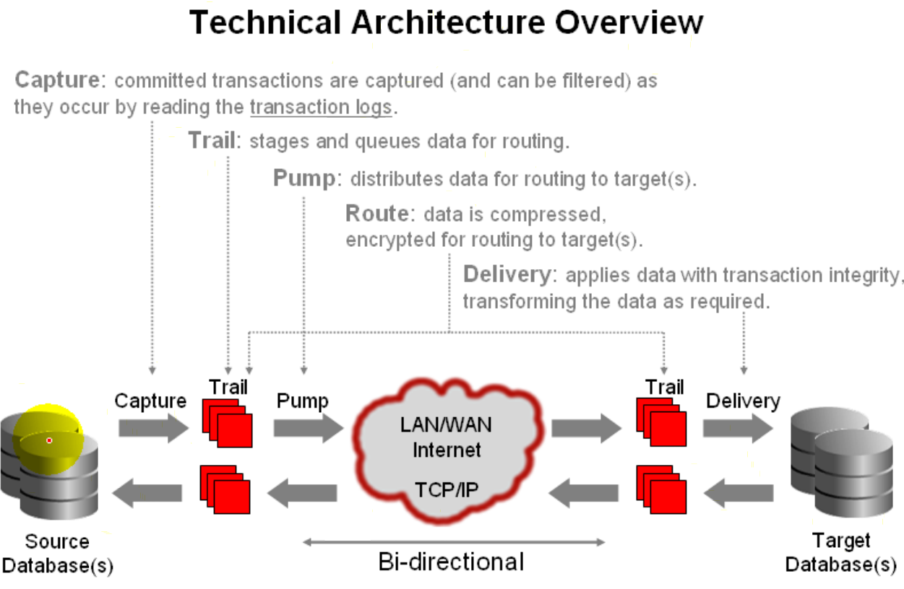
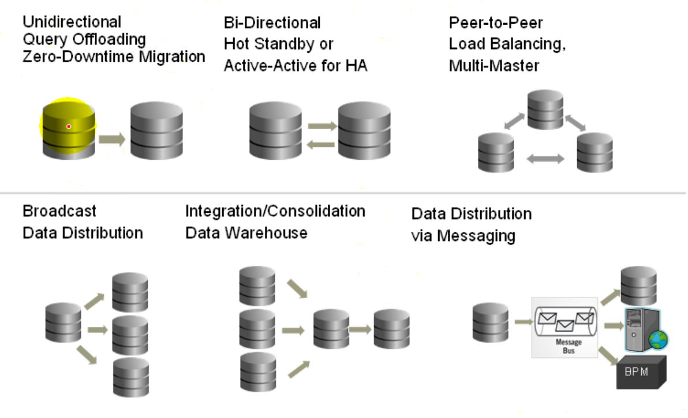
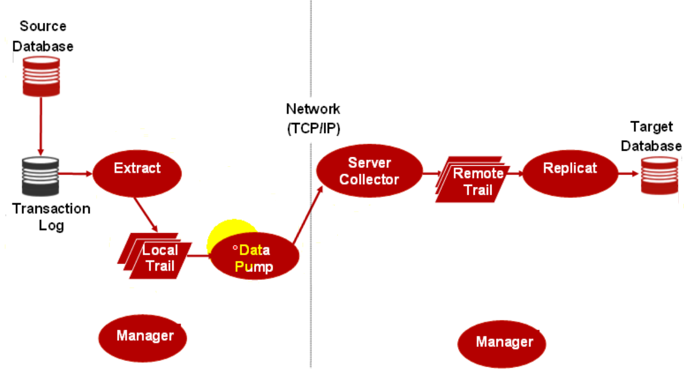

## Oracle GoldenGate

### 简介

* 是数据库之间进行数据复制的软件，主要功能如下：
  * 主要是用于抓取源数据库的数据变化并传送到目标数据库中，同步目标数据库。
  * 初始化加载：第一次执行的时候先把源数据库的数据复制到目标数据库。
  * 这两个功能是异构性的---就是说不同OGG提供了不同数据库、系统之间的复制。
    * 比如Oracle复制到Oracle很好导，但是导入到MySQL就复杂一点了，比如导成Excel，然后MySQL端要支持Excel的导入。
    * 但是官方也说明如果是同构数据库（Homogeneous），还是使用数据库自带的备份功能。
* 可以实时的把事务数据传送到分析系统上。

以下是使用OGG前需要了解的一些基本概念：

### 事务数据管理系统 Transactional Data Management

* OGG是一个Transactional Data Management，有以下优点。

* 实时（real time）：亚秒级的数据传输。
  * 对系统占用资源很少。
* 异构（Heterogeneous）：能够支持多种数据库之间的复制。
  * 可拓展性高。
* 事务（Transactional）：确保事务的完整性。
  * 只会抓取完整的变化数据。

### 技术架构 Technical Architecture 

* OGG的实现主要是以下几步：

1. Capture：读取联机日志或者归档日志（transaction logs），读取时只会读取完整提交的事务，而且可以自定义过滤器（filter），读取了以后会放在Trail中。
2. Trail：其实就是磁盘的文件，GoldenGate自定义的一个文件格式，相当于一个待发送队列。
3. Pump：读取Trail文件，通过网络发送到目标数据库的服务器，放在远端的Trail中。
4. Delivery：抓取Trail文件，通过SQL语句，写道数据库中。

备注：这个架构是可以双向的，双向的时候可能会有数据问题，比如表1和表2同时修改了1条数据，配置的时候要避免。

### 应用场景  Oracle GoldenGate Topologies

* 单向复制：分担查询负载，备份。
* 双向复制：双业务中心。
* 点对点：多个数据库之间复制。
* 分发：分发到不同数据库中。
* 集成--多个数据源收缩到1个数据库。
* 信息分发：分发到不同的系统中。

### OGG提供的软件

* Director： OGG的图形化管理工具（SQL Plus也能做）。
* Veridate：提供了对比不同表的数据的功能。

### 组件简介 Components

* Manager： Oracle GoldenGate管理进程，最先启动的进程，用于管理其他**进程**。
* Extract： 捕获变更数据的**进程**，运行在源端。
  * 抓取的数据可以直接放在内存中，并实时发送到目标端的Collector进程。
  * 抓取的数据也可以放在本地的Trail文件中，等待Data Pump发送，这个方案会更好，避免了网络问题，虽然速度会慢。
* Trails or extract files：同上文，其实GoldenGate的一个**磁盘文件**，存储抓取到的变化数据。
  * 文件名前两个字符可以自定义，后面是6位流水。
* Data Pump： 读取trail并且通过网络发送trail到目标端trail的**进程**。
  * 设置Data Pump可以做数据的分发和过滤。
* Collector：接收Extract发送的数据或接收Trail文件。接收后写入到目标端的Trail中的**进程**。
* Replicate：抓取Trail文件，通过SQL语句，写道数据库中的**进程**
* Checkpoints：检查点，存储从文件读取和写入的检测点位置的**磁盘文件或目标数据库的某个表**（就是存储Trail写到数据变化日志的哪一个地方），用于还原和恢复数据。

### 进程组 process group

一个进程组包含：

* 1个Extract或者Replicate进程
* 进程的配置文件（parameter file）
* 检查点文件
* 其他相关的文件（Trail）

每个组需要有一个唯一的名字。

### GGSCI

* 相当于OGG的SQL Plus