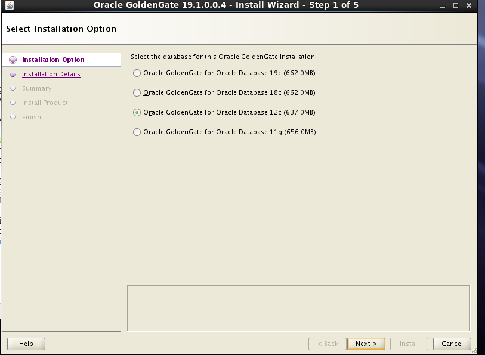
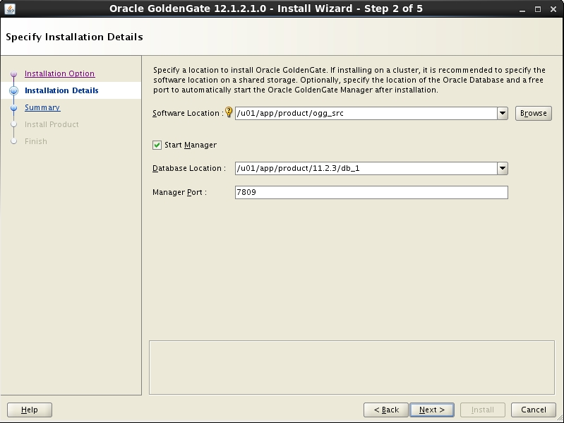
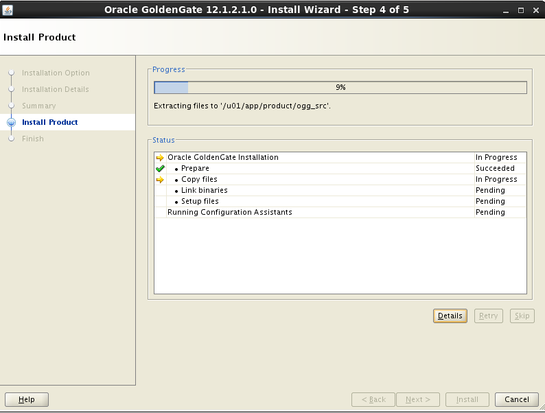
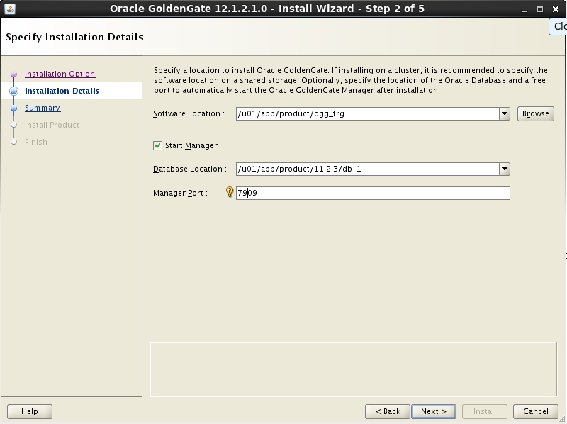
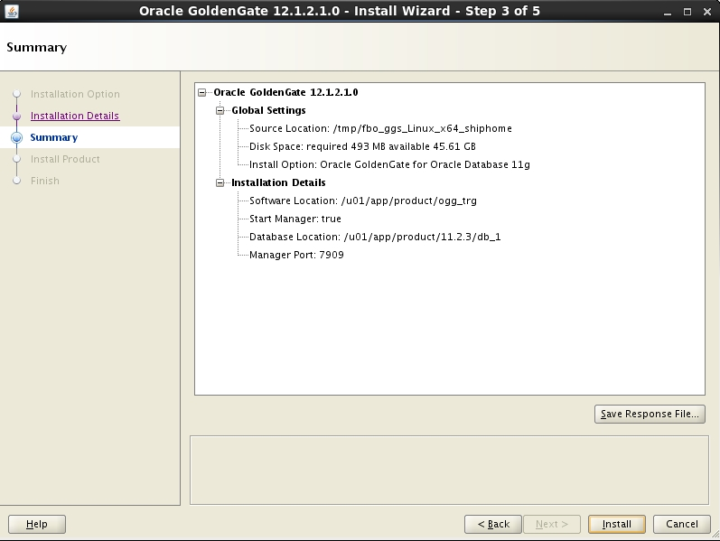
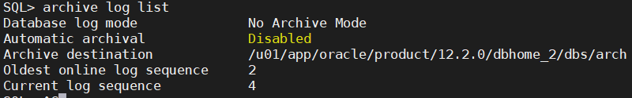
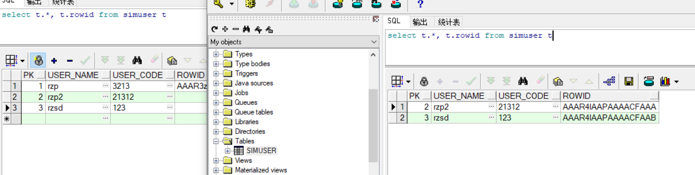

## 1.前置准备

实验分别在两台机器上的/u01/app/product/ogg_src目录下安装；

```
[oracle@sywu ~]$ mkdir -p /u01/app/product/ogg_src
```

Linux下安装GoldenGate要配置ORACLE_SID、ORACLE_HOME和LD_LIBRARY_PATH；

```

JAVA_HOME=/usr/java/jdk1.8.0_65
CLASSPATH=.:$JAVA_HOME/lib/dt.jar:$JAVA_HOME/lib/tools.jar
HADOOP_HOME=/usr/hop/hadoop-2.7.7
ORACLE_BASE=/u01/app/oracle
ORACLE_HOME=$ORACLE_BASE/product/12.2.0/dbhome_1
ORACLE_SID=orcl
LD_LIBRARY_PATH=$ORACLE_HOME/lib:$ORACLE_HOME/lib32
GGATE=/u01/app/product/ogg_src/
export ORACLE_BASE ORACLE_HOME ORACLE_SID LD_LIBRARY_PATH GGATE
PATH=$PATH:$JAVA_HOME/bin:$HADOOP_HOME/bin:$HADOOP_HOME/sbin:$ORACLE_HOME/bin:$ORACLE_HOME/OPatch
export PATH JAVA_HOME CLASSPATH HADOOP_HOME
```

注意:数操作系统版本、据库版本和Oracle GoldenGate版本bit type要一致，要么全是32bit要么全是64bit;

## 2.开始安装

##### 1.解压文件

```
unzip xxx.zip
```

##### 2.授予权限

```bash
chmod -R 755 /u01
```

##### 3.执行安装程序

```java
runInstaller 
```

##### 4.选择对应数据库



##### 5.更改GoldenGate Software 安装位置，将其安装到/u01/app/product/ogg_src目录下，检查数据库安装位置是否正确，并配置端口；



##### 6.检查安装信息，确认无误后开始安装；



## 3.2 安装目标端GoldenGate

目标端的配置和安装与源端的安装步骤上都相同，唯一不同的地方是如果在同一台机器上安装源端和目标端，则要将其安装在不同的目录下(比如：/u01/app/product/ogg_trg)，并且配置不同的端口(此处是7909);



#### 配置别名

安装完成后配置OGG命令行快捷命令和回写功能，在.bash_profile配置文件中添加如下内容:

```bash
alias ggsci=' /u01/app/product/ogg_src/ggsci'
#如果是同一台机器
alias tggsci=' /u01/app/product/ogg_trg/ggsci'
alias sggsci=' /u01/app/product/ogg_src/ggsci'
```

上面通过别名的方式配置了源端的OGG ggsci命令sggsci，目标端的OGG ggsci命令tggsci并通过rlwrap 使其支持回写功能，这样在任何位置都可以使用OGG ggsci命令;

该版本默认已经自动建立子目录，早期版本可能需要在GGSCI命令行下使用create subdirs命令手工创建；安装完成后查看mgr进程应为running状态;

```
[oracle@sywu ~]$ ggsci

Oracle GoldenGate Command Interpreter for Oracle
Version 12.1.2.1.0 OGGCORE_12.1.2.1.0_PLATFORMS_140727.2135.1_FBO
Linux, x64, 64bit (optimized), Oracle 11g on Aug  7 2014 09:14:25
Operating system character set identified as UTF-8.

Copyright (C) 1995, 2014, Oracle and/or its affiliates. All rights reserved.


GGSCI (sywu) 1> view param mgr

PORT 7909


GGSCI (sywu) 2> info mgr

Manager is running (IP port sywu.7909, Process ID 16870).
```

alias ggsci=' /u01/app/oracle/product/ogg_src/ggsci'

## 4 GoldenGate目录结构

| 说明                       | 后缀名 | 目录路径                        |
| -------------------------- | ------ | ------------------------------- |
| Parameter files            | .prm   | /u01/app/product/ogg_src/dirprm |
| Report files               | .rpt   | /u01/app/product/ogg_src/dirrpt |
| Checkpoint files           | .cpr   | /u01/app/product/ogg_src/dirchk |
| Process status files       | .pcs   | /u01/app/product/ogg_src/dirpcs |
| SQL script files           | .sql   | /u01/app/product/ogg_src/dirsql |
| Database definitions files | .def   | /u01/app/product/ogg_src/dirdef |
| Extract data files         |        | /u01/app/product/ogg_src/dirdat |
| Temporary files            |        | /u01/app/product/ogg_src/dirtmp |
| Credential store files     | .crd   | /u01/app/product/ogg_src/dircrd |
| Masterkey wallet files     | .wlt   | /u01/app/product/ogg_src/dirwlt |
| Dump files                 | .dmp   | /u01/app/product/ogg_src/dirdmp |

## 数据库配置

* Source和Target端开启OGG复制

```bash
#sqlplus开启复制
SQL> alter system set enable_goldengate_replication=true;

System altered.
```

#### 归档模式

​	source端配置

​	GoldenGate的原理是基于对日志变化的捕获（CDC）。所以Oracle的redo对于GoldenGate至关重要。为了保证GoldenGate能读取到完整的事务日志，必须打开归档。

```bash
#查看数据库日志模式
archive log list
```

下图说明当前为非归档模式。



按以下步骤修改为归档模式

```bash
#关闭数据库
SQL> shutdown immediate
Database closed.
Database dismounted.
ORACLE instance shut down.
#开启数据库加载
SQL> startup mount
ORACLE instance started.

Total System Global Area 1610612736 bytes
Fixed Size                  8793304 bytes
Variable Size            1040188200 bytes
Database Buffers          553648128 bytes
Redo Buffers                7983104 bytes
Database mounted.
#修改日志模式
SQL> alter database archivelog
  2  /

Database altered.
#数据库开启模式
SQL> alter database open
  2  /

Database altered.
#查看数据库是否已开启
SQL> select status from v$instance;

STATUS
------------
OPEN
#查看日志模式
SQL> archive log list
Database log mode              Archive Mode
Automatic archival             Enabled
Archive destination            /u01/app/oracle/product/12.2.0/dbhome_2/dbs/arch
Oldest online log sequence     2
Next log sequence to archive   4
Current log sequence           4
SQL>


```

##### 备注：如果开启任何进程有问题，都可以通过这个命令查看找问题：

```bash
view report 进程名
比如
view report mgr
```


* 强制日志

  source端配置

```sql
/*查看强制日志模式是否打开*/
SQL> SELECT force_logging FROM v$database;

FORCE_LOGGING
---------------------------------------
NO
/*打开强制日志模式*/
SQL> ALTER DATABASE FORCE LOGGING;

Database altered.
/*检查强制日志模式是否打开*/
SQL> SELECT force_logging FROM v$database;

FORCE_LOGGING
---------------------------------------
YES

/*切换日志*/
SQL> ALTER SYSTEM SWITCH LOGFILE;

System altered.

```

#### 补充日志（supplemental log）

source端配置

Supplemental Logging，对于修改操作，Oracle会把PK（或其他唯一标识）记录到redo log中，这样生成的redo日志量是最少的。

如果没有主键，redo数据量会很大，效率很低，所以Oracle 建议所有需要复制的表都存在主键或者唯一键。 

```sql
/*查看补充日志模式是否打开*/
SQL> SELECT supplemental_log_data_min FROM v$database;

SUPPLEME
--------
NO
/*打开补充日志模式*/
SQL> alter database add supplemental log data;

Database altered.

SQL> SELECT supplemental_log_data_min FROM v$database;

SUPPLEME
--------
YES

/*修改补充日志内容*/
SQL> alter database add supplemental log data (all,primary key,unique index,foreign key) columns ;

Database altered.

SQL> alter database add supplemental log data for procedural replication;

Database altered.

SQL>  select * from DBA_SUPPLEMENTAL_LOGGING ;

MIN PRI UNI FOR ALL PRO
--- --- --- --- --- ---
YES YES YES YES YES YES


```

#### 创建OGG用户

* OGG连接数据库使用的用户

source和target端配置

```sql
/*转移到PDB容器*/
SQL> alter session set container=ORCLPDB;

Session altered.
/*开启数据库*/
SQL> startup
Pluggable Database opened.

/*建立表空间*/
SQL> create tablespace tbs_ggs datafile '/u01/app/oracle/oradata/orcl/orclpdb/ggs01.dbf' size 500m autoextend on maxsize 30g;

Tablespace created.

/*转移到CDB容器*/
SQL> alter session set container=CDB$ROOT;

Session altered.

/*建立表空间*/
SQL>  create tablespace tbs_ggs datafile '/u01/app/oracle/oradata/orcl/ggs001.dbf' size 500m autoextend on maxsize 30g;

Tablespace created.

/*建立CDB用户*/
SQL> create user c##ggsadmin identified by ggsadmin default tablespace tbs_ggs;

User created.

/*授权*/
SQL> grant dba to c##ggsadmin container=all;

Grant succeeded.

SQL> grant ggsys_role to c##ggsadmin container=all;

Grant succeeded.

SQL> exec  dbms_goldengate_auth.grant_admin_privilege('c##ggsadmin',container=>'ALL');

PL/SQL procedure successfully completed.

SQL>  commit;

Commit complete.

/*创建PDB层级用户*/
SQL> alter session set container=ORCLPDB;

Session altered.

SQL> create user ggsadmin identified by ggsadmin default tablespace tbs_ggs;

User created.

SQL> grant dba to ggsadmin;

Grant succeeded.

SQL> grant ggsys_role to ggsadmin;

Grant succeeded.

```


#### 关闭回收站

source和target端配置

```sql
SQL> alter system set recyclebin=off scope=spfile;

System altered.

```

#### tns配置

source和target端配置

```sql
tns_node1_orcl =
  (DESCRIPTION =
    (ADDRESS = (PROTOCOL = TCP)(HOST = 192.168.98.129)(PORT = 1521))
    (CONNECT_DATA =
      (SERVER = DEDICATED)
      (SERVICE_NAME = orcl)
    )
  )

tns_node1_orclpdb =
  (DESCRIPTION =
    (ADDRESS = (PROTOCOL = TCP)(HOST = 192.168.98.129)(PORT = 1521))
    (CONNECT_DATA =
      (SERVER = DEDICATED)
      (SERVICE_NAME = orclpdb)
    )
  )

tns_node2_orcl =
  (DESCRIPTION =
    (ADDRESS = (PROTOCOL = TCP)(HOST = 192.168.98.130)(PORT = 1521))
    (CONNECT_DATA =
      (SERVER = DEDICATED)
      (SERVICE_NAME = orcl)
    )
  )

tns_node2_orclpdb =
  (DESCRIPTION =
    (ADDRESS = (PROTOCOL = TCP)(HOST = 192.168.98.130)(PORT = 1521))
    (CONNECT_DATA =
      (SERVER = DEDICATED)
      (SERVICE_NAME = orclpdb)
    )
  )
```

#### 创建测试数据

```sql
/*转移到PDB容器*/
SQL> alter session set container=ORCLPDB;

Session altered.
/*开启数据库*/
SQL> startup
Pluggable Database opened.

/*建立表空间*/
SQL> create tablespace sim datafile '/u01/app/oracle/oradata/orcl/orclpdb/sim.dbf' size 500m autoextend on maxsize 30g;

SQL> create user sim identified by sim default tablespace sim;

User created.

SQL> grant dba to sim;

Grant succeeded.

/*使用sim登录*/
create table simuser(
PK number,
user_name varchar2(50),
user_code varchar2(50))


/*PLSQL登录不上可以重新改一次密码(即使密码肯定正确，也重新改一次）和执行下面
我两个都做过所以不清楚*/
grant connect,resource to sim;

```


## OGG配置

### Source端

#### GLOBALS参数文件

GLOBALS文件中存的参数对全局起作用（注意这里GLOBAL总是大写）参数可以有mgrservname、checkpointtable、ggschema、ddltable、markertable、outputfileumask。

```bash
#GLOBALS文件放在ogg安装根目录下，现在刚安装完应该是没有的
[oracle@node-1 ogg_src]$ ls -l | grep GLOBALS
#进入ggsci端
[oracle@node-1 ogg_src]$ ./ggsci

Oracle GoldenGate Command Interpreter for Oracle
Version 19.1.0.0.4 OGGCORE_19.1.0.0.0_PLATFORMS_191017.1054_FBO
Linux, x64, 64bit (optimized), Oracle 12c on Oct 18 2019 01:38:51
Operating system character set identified as UTF-8.

Copyright (C) 1995, 2019, Oracle and/or its affiliates. All rights reserved.


#输入命令
GGSCI (node-1) 1> edit params ./GLOBALS
#ggsci会调用vi编辑器，生成一个空白文档
#在文档里面填入以下内容(不包括注释）,保存退出即可
#内容解释
#ENABLEMONITORING 启用后从Oracle GoldenGate Monitor监视Oracle GoldenGate实例
#CHECKPOINTTABLE 设置检查点的表名
#GGSCHEMA ogg登录数据库使用的用户名
ENABLEMONITORING
CHECKPOINTTABLE CDB$ROOT.c##ggsadmin.checkpoint 
GGSCHEMA c##ggsadmin


```

* 配置认证证书(密码设置)

```
#进入ggsci，创建认证证书
GGSCI (node-1) 1> add credentialstore

Credential store created.
#修改密码
GGSCI (node-1) 2> alter credentialstore add user c##ggsadmin@tns_node1_orcl,password ggsadmin alias ogg1

Credential store altered.

#显示证书信息
GGSCI (node-1) 3>  info credentialstore

Reading from credential store:

Default domain: OracleGoldenGate

  Alias: ogg1
  Userid: c##ggsadmin@tns_node1_orcl

#测试登录
GGSCI (node-1) 4> dblogin useridalias ogg1
Successfully logged into database CDB$ROOT.


```

#### Manager

```bash
#检查manager是否启动
GGSCI (node-1) 1> info all

Program     Status      Group       Lag at Chkpt  Time Since Chkpt

MANAGER     RUNNING
JAGENT      STOPPED
PMSRVR      STOPPED

#关闭Manager
GGSCI (node-1) 2> stop mgr
Manager process is required by other GGS processes.
Are you sure you want to stop it (y/n)?y

Sending STOP request to MANAGER ...
Request processed.
Manager stopped.

#检查manager是否启动
GGSCI (node-1) 3> info all

Program     Status      Group       Lag at Chkpt  Time Since Chkpt

MANAGER     STOPPED
JAGENT      STOPPED
PMSRVR      STOPPED

#修改mgr参数
GGSCI (node-1) 4> edit params mgr

#填入以下内容，解释见后文，保存退出

PORT 7809
DYNAMICPORTLIST 7810-7890
AUTOSTART EXTRACT *
AUTORESTART EXTRACT *,RETRIES 5, WAITMINUTES 3,RESETMINUTES 5
PURGEOLDEXTRACTS ./dirdat/*,usecheckpoints, minkeepdays 7
LAGREPORTHOURS 1
LAGINFOMINUTES 30
LAGCRITICALMINUTES 45


#启动Manager
GGSCI (node-1) 2> start mgr
Manager started.

#检查管理进程参数
GGSCI (node-1) 4> view param mgr

PORT 7809
DYNAMICPORTLIST 7810-7890
AUTOSTART EXTRACT *
AUTORESTART EXTRACT *,RETRIES 5, WAITMINUTES 3,RESETMINUTES 5
PURGEOLDEXTRACTS ./dirdat/*,usecheckpoints, minkeepdays 7
LAGREPORTHOURS 1
LAGINFOMINUTES 30
LAGCRITICALMINUTES 45


```

解释

```bash
#OGG端口，安装时设置的
PORT 7809
#抓取和复制进程使用的端口
DYNAMICPORTLIST 7810-7890
#Manager启动后自动启动的进程
AUTOSTART EXTRACT *
#监控Extract进程，如果有问题了自动重启，重启次数5次，间隔5分钟
AUTORESTART EXTRACT *,RETRIES 5, WAITMINUTES 3,RESETMINUTES 5
#自动清除trail文件，trail文件保留时间为7天
PURGEOLDEXTRACTS ./dirdat/*,usecheckpoints, minkeepdays 7
#每隔一小时检查一次传输延迟情况
LAGREPORTHOURS 1
#传输延时超过30分钟将写入错误日志
LAGINFOMINUTES 30
#传输延时超过45分钟将写入警告日志
LAGCRITICALMINUTES 45
```

#### 创建 integrated 类型

* ORCLPDB.sim  sim是要同步的表空间名字

* 从OGG 11.2按本开始，对于Source为Oracle的数据库，Extract 支持classic capture 和 integrated capture mode两种模式:

  * classic capture mode    就是以前用的那种从联机或归档日志中挖掘交易日志的方法

  * integrated capture

    OGG 11.2版本开始支持的新的挖掘交易日志的方法，不过对Oracle RDBMS的版本要求比较高，参见前面数据库要求中的说明.在这种模式下，Extract进程直接从database logmining server
    接收数据变化的logical change records (LCR). 这种模式要求Oracle数据库必须处于归档模式下。 

```bash
GGSCI (node1) 4> dblogin useridalias ogg1
#开启表级别的补充日志，否则update不能成功复制
GGSCI (node1 as c##ggsadmin@rac01/CDB$ROOT) 4> add schematrandata ORCLPDB.sim
GGSCI (node1 as c##ggsadmin@rac01/CDB$ROOT) 5> add trandata ORCLPDB.sim.*

GGSCI (node1 as c##ggsadmin@rac01/CDB$ROOT) 4> info schematrandata ORCLPDB.sim
GGSCI (node1 as c##ggsadmin@rac01/CDB$ROOT) 6> info trandata ORCLPDB.sim.*
GGSCI (node1 as c##ggsadmin@rac01/CDB$ROOT) 7> add checkpointtable CDB$ROOT.c##ggsadmin.checkpoint 
```

#### Extract

```bash
#启动extract进程
GGSCI (node-1) 1> add extract ext,integrated tranlog,begin now
EXTRACT (Integrated) added.

#创建trail文件
GGSCI (node-1) 2> add exttrail ./dirdat/ea,extract ext
EXTTRAIL added.


#注册ext进程到orclpdb容器中
GGSCI (node-1) 3> dblogin useridalias ogg1
Successfully logged into database CDB$ROOT.

GGSCI (node-1 as c##ggsadmin@orcl/CDB$ROOT) 4>  register extract ext database container (ORCLPDB)

2020-04-10 00:46:11  INFO    OGG-02003  Extract EXT successfully registered with database at SCN 1880986.
#配置Extract配置文件
GGSCI (node1) 5> edit params ext

#添加以下内容
EXTRACT ext
setenv (NLS_LANG=AMERICAN_AMERICA.AL32UTF8)
USERIDALIAS ogg1
EXTTRAIL ./dirdat/ea
table ORCLPDB.sim.*;

```

解释

```bash
#extract进程组名称
EXTRACT ext
#字符集
setenv (NLS_LANG=AMERICAN_AMERICA.AL32UTF8)
#用户登录别名,配置了认证证书后可以调用
USERIDALIAS ogg1
#Trail文件路径和名称前两个自定义字符
EXTTRAIL ./dirdat/ea
#抽取什么表
table RAC01PDB.peiyb.*;
#后续待了解https://docs.oracle.com/goldengate/1212/gg-winux/GWURF/gg_parameters.htm#GWURF995
TRANLOGOPTIONS DBLOGREADER
FETCHOPTIONS NOUSESNAPSHOT
GETTRUNCATES

DISCARDFILE ./dirrpt/ea.dsc, APPEND, MEGABYTES 40
WARNLONGTRANS 1H, CHECKINTERVAL 5M
CACHEMGR CACHESIZE 1024MB, CACHEDIRECTORY ./dirtmp

LOGALLSUPCOLS
NOCOMPRESSUPDATES
UPDATERECORDFORMAT FULL
--ddl include all
--ddloptions report
REPORTCOUNT EVERY 5 SECONDS, RATE


```

开启进程测试：

```bash
#查看所有进程，看到extract是关闭状态
GGSCI (node-1) 2> info all

Program     Status      Group       Lag at Chkpt  Time Since Chkpt

MANAGER     RUNNING
JAGENT      STOPPED
PMSRVR      STOPPED
EXTRACT     STOPPED     EXT         00:00:00      00:14:58

#开启extract进程
GGSCI (node-1) 5> start extract ext

Sending START request to MANAGER ...
EXTRACT EXT starting

#开启成功
GGSCI (node-1) 6> info all

Program     Status      Group       Lag at Chkpt  Time Since Chkpt

MANAGER     RUNNING
JAGENT      STOPPED
PMSRVR      STOPPED
EXTRACT     RUNNING     EXT         00:00:00      00:21:36


```

管理extract抓取进程命令
GGSCI > start extract ext –启动ext进程
GGSCI > stop extract ext –关闭ext进程
GGSCI > kill extract ext --强制停止ext进程
GGSCI > info extract ext --查看进程参数信息
GGSCI > stats extract ext --查看进程运行信息
GGSCI > view report ext —查看运行报告

#### Pump

```bash
#添加本地trail文件
GGSCI (node-1) 1> add extract pump,exttrailsource ./dirdat/ea
EXTRACT added.
#添加目标端trail文件
GGSCI (node-1) 2> add rmttrail ./dirdat/pa,extract pump
RMTTRAIL added.

GGSCI (node-1) 3> edit params pump
#添加以下内容
extract pump
USERIDALIAS ogg1
rmthost 192.168.98.130,mgrport 7809,compress
rmttrail ./dirdat/pa
passthru
table ORCLPDB.sim.*;
```

解释

```bash
#进程名称
extract pump
USERIDALIAS ogg1
#远程地址
rmthost 192.168.98.130,mgrport 7809,compress
rmttrail ./dirdat/pa
#原样的映射，过滤，转换传输数据?
passthru
table ORCLPDB.sim.*;
```

命令

```bash
GGSCI > start extract pump –启动pump进程  
GGSCI > stop extract pump –关闭pump进程  
GGSCI > kill extract pump --强制停止pump进程  
GGSCI > info pump --查看进程参数信息  
GGSCI > stats pump --查看进程运行信息  
GGSCI > view report pump ---查看运行报告 
```

### Trage 端

#### GLOBALS参数

```bash
$ ./ggsci
GGSCI (node2) 1> edit params ./GLOBALS

ENABLEMONITORING
CHECKPOINTTABLE ggsadmin.chkpt 
GGSCHEMA ggsadmin
```

#### 认证证书

```bash
$ ./ggsci
GGSCI (node2) 1> add credentialstore
GGSCI (node2) 2> alter credentialstore add user ggsadmin@tns_node2_orclpdb,password ggsadmin alias ogg2
GGSCI (node2) 3> info credentialstore
GGSCI (node2) 4> dblogin useridalias ogg2
```

#### Manager

```bash
$ ./ggsci
GGSCI (node2) 1> edit params mgr

PORT 7809
DYNAMICPORTLIST 7810-7890
AUTOSTART REPLICAT *
AUTORESTART REPLICAT *,RETRIES 5, WAITMINUTES 3,RESETMINUTES 5
PURGEOLDEXTRACTS /u01/app/oracle/ogg/12.3/dirdat/*,usecheckpoints, minkeepdays 7
LAGREPORTHOURS 1
LAGINFOMINUTES 30
LAGCRITICALMINUTES 45

GGSCI (node1) 2> stop mgr
GGSCI (node1) 3> start mgr
GGSCI (node1) 3> info all
```

#### Replicat

```bash
#使用ogg2登录
GGSCI (node-2) 15> dblogin useridalias ogg2
Successfully logged into database ORCLPDB.

#创建检查点表
GGSCI (node-2 as ggsadmin@orcl/ORCLPDB) 16> add checkpointtable ggsadmin.chkpt
Logon catalog name ORCLPDB will be used for table specification ORCLPDB.ggsadmin.chkpt.

Successfully created checkpoint table ORCLPDB.ggsadmin.chkpt.

#创建replicat进程 trail文件
GGSCI (node-2 as ggsadmin@orcl/ORCLPDB) 17> add replicat rep,exttrail ./dirdat/pa checkpointtable ggsadmin.chkpt
REPLICAT added.

#修改配置信息
GGSCI (node-2 as ggsadmin@orcl/ORCLPDB) 18> edit params rep

#填入以下配置
REPLICAT rep
USERIDALIAS ogg2
setenv (NLS_LANG="AMERICAN_AMERICA.AL32UTF8")
HANDLECOLLISIONS
ASSUMETARGETDEFS
ddloptions report
discardfile ./dirout/RAMER.DSC, purge
MAP ORCLPDB.sim.*, TARGET ORCLPDB.sim.*;

#开启进程
GGSCI (node-2 as ggsadmin@orcl/ORCLPDB) 20> start replicat rep

Sending START request to MANAGER ...
REPLICAT REP starting
```

解释

```bash
REPLICAT rep
USERIDALIAS ogg2
setenv (NLS_LANG="AMERICAN_AMERICA.AL32UTF8")

#HANDLECOLLISIONS
#https://www.cnblogs.com/margiex/p/9095531.html
#就是对于主键冲突的处理详细见该网址,一般只应该用在初始化阶段
HANDLECOLLISIONS
#当原表和目标表结构相同，使用ASSUMETARGETDEFS
ASSUMETARGETDEFS
#
ddloptions report
#定义discardfile文件位置，如果处理中油记录出错会写入到此文件中；
discardfile ./dirout/RAMER.DSC, purge
#来源和目标
MAP ORCLPDB.sim.*, TARGET ORCLPDB.sim.*;
```

命令

```bash
GGSCI > start replicat rep –启动rep进程  
GGSCI > stop replicat rep –关闭rep进程  
GGSCI > kill replicat rep --强制停止e1进程  
GGSCI > info replicat rep --查看进程参数信息  
GGSCI > stats replicat rep --查看进程运行信息  
GGSCI > view report rep ---查看运行报告 
```


### 测试

在源端的simuser表中添加记录，刷新目标端的simuser表，发现有数据自动复制



## 备忘：容器操作

```sql
/*查看CDB容器名称*/
SQL> show con_name;

CON_NAME
------------------------------
CDB$ROOT

/*查看当前容器名称*/
SQL> select sys_context('userenv','con_name') from dual;

SYS_CONTEXT('USERENV','CON_NAME')
--------------------------------------------------------------------------------
CDB$ROOT

/*查看PDB容器*/
SQL> select con_id,dbid,name,open_mode from v$pdbs;

    CON_ID       DBID          NAME    OPEN_MODE
---------- ---------- ------------- -------------
         2 2352354190      PDB$SEED    READ ONLY
         3 3985618053      ORCLPDB      MOUNTED

/*容器切换*/
alter session set container=ORCLPDB;     //切换到PDB
alter session set container=CDB$ROOT;   //切换到CDB

```

